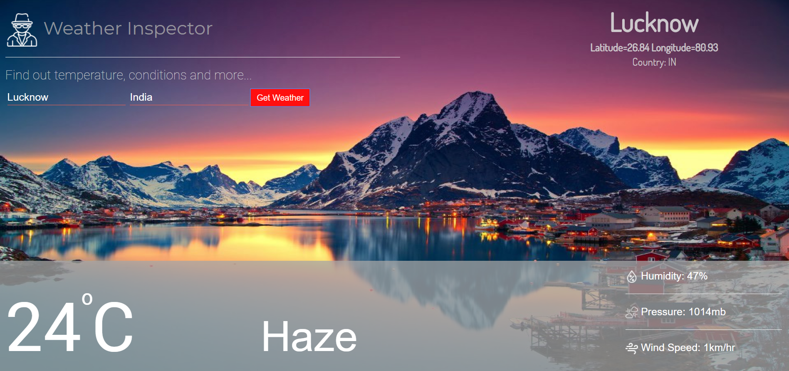

# Weather Inspector
This project is used to get the instant weather of any area throughout the world. You just have to mention the name of the city or town and the country and this app will give you the current temperature of that place. In addition to this, it will also give the information of current weather condition, pressure, humidity and wind speed.
#
API USED - OpenweatherApi.
#
Here is the the sample overview of the main page...
# 

# 

